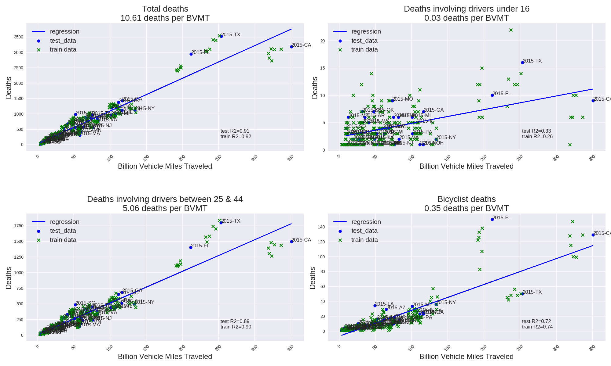

## Introduction

In 2015, the total number of traffic deaths increased from 32,700 to 35,100 or 7% whereas vehicle miles traveled (VMT) increased from 3.04 to 3.13 trillion miles or 3%.  Although this jump is large, the number of deaths per miles traveled is in line with historical data back to 2009.  

A linear regression model shows that the number of vehicle miles traveled is a significant predictor for fatalities.  The independent variable is annual vehicle miles traveled (VMT) reported by a state in a particular year.  The dependent variable is the number of annual deaths reported in that year for that state.  The regression model is developed using data from 2009 to 2014.  The resulting linear estimate is then used to predict the number of 2015 deaths for each state and compared with actual results.
  

  
  For total deaths as a function of vmt, the training R-squared is 0.92 vs .91 for the model against the 2015 data.  The slope of the line is 10,609 deaths per million miles.
For deaths between the ages of 25 and 44, the R-squared is .90 training and .89 test.  The estimated death rate is 5061 deaths per million miles.

Bicycle deaths are also well correlated with vmt, with an R-squared of 0.74 train and .72 test and a death rate of 347 per million miles.     It appears that death rates for bicyclist are lower than for drivers at least with respect to exposure to vehicle traffic.  Also of note is that the vehicle death rates for large states like Texas and Florida are higher than average whereas California has a lower rate.  In addition Florida has a very high bicycle death rate relative to other states.
